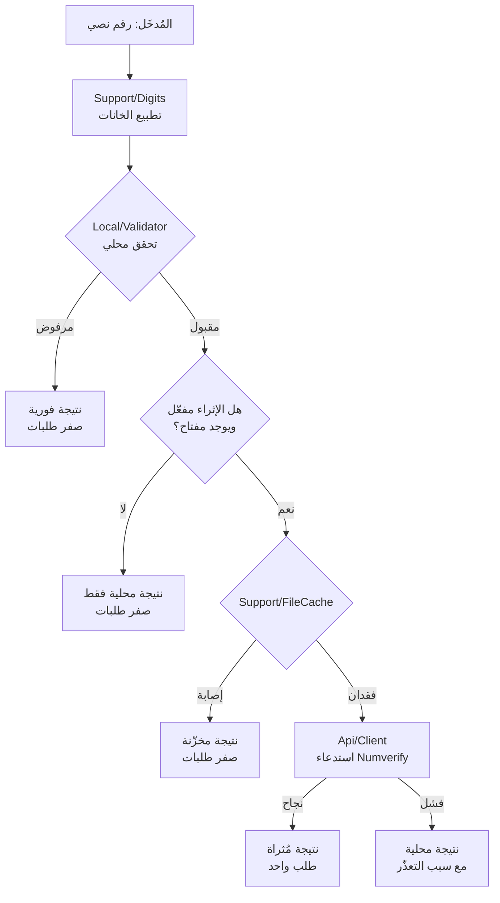
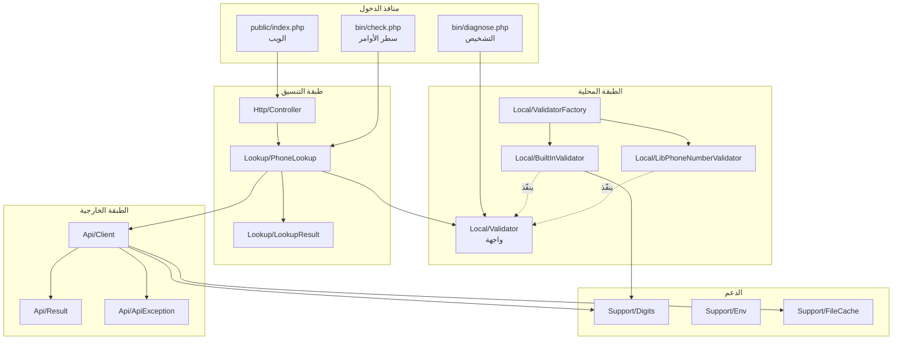
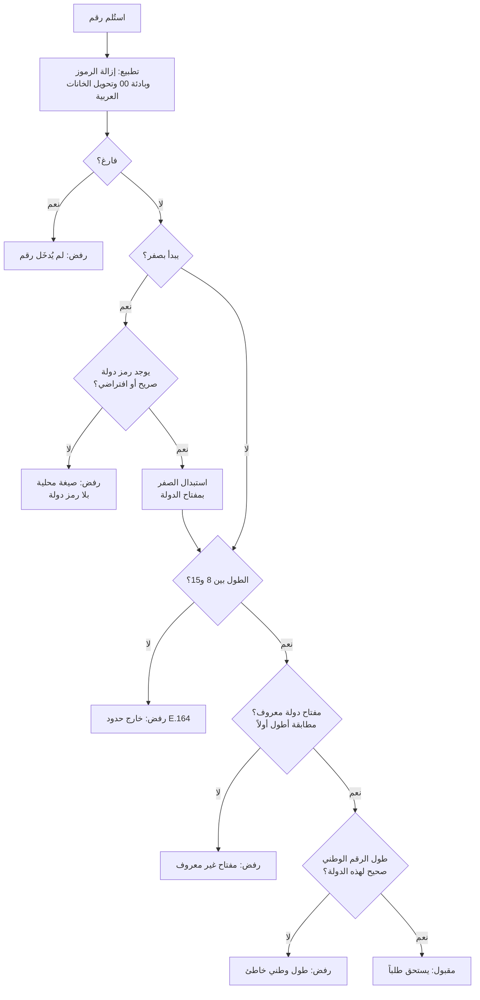
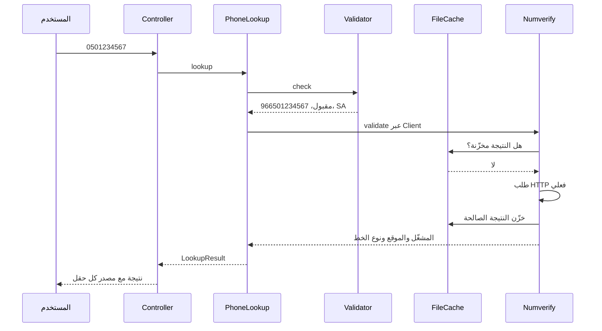
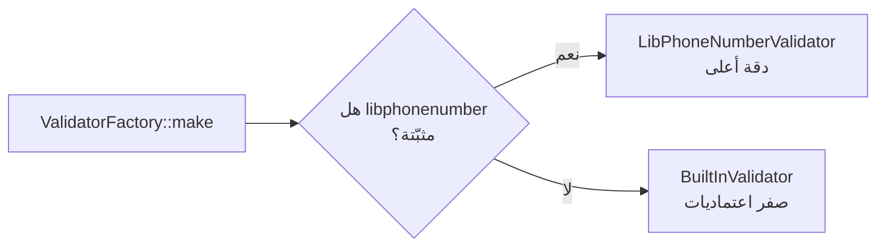

# البنية والمخططات

## المخطط العام



النقطة الجوهرية في المخطط: ثلاثة من خمسة مسارات خروج تكلّف **صفر طلبات**.

## طبقات المشروع



## قواعد الاعتماد

هذه القواعد هي ما يجعل المشروع قابلاً للاختبار بلا إنترنت:

| الطبقة | تعرف عن | لا تعرف عن |
|---|---|---|
| `Local/` | التطبيع وخطط الترقيم | الشبكة، Numverify، HTTP |
| `Api/` | Numverify وحدها | HTML، الواجهة، التحقق المحلي |
| `Lookup/` | الطبقتين معاً | HTTP، طريقة العرض |
| `Http/` | `Lookup/` فقط | Numverify، تفاصيل التحقق |

السهم يتجه دائماً من الأعلى إلى الأسفل. لا تعرف طبقة سفلى شيئاً عمّن يستدعيها.

## قرار صرف الطلب



كل مسار رفض ينتهي برسالة محددة تشرح السبب، لا برسالة عامة واحدة.

## تسلسل استعلام كامل



## اختيار المحرك المحلي



القرار يحدث مرة واحدة عند الإقلاع، ولا تعرف بقية الطبقات أي محرك يعمل — تتعامل
مع واجهة `Validator` وحدها. اسم المحرك يظهر أسفل الواجهة لتتأكد بنفسك.

## شجرة الملفات

```
src/
  Local/                       الطبقة المحلية
    Validator.php              الواجهة المشتركة
    BuiltInValidator.php       جدول 46 دولة، بلا اعتماديات
    LibPhoneNumberValidator.php محوّل لمكتبة Google
    ValidatorFactory.php       يختار الأدق المتاح
    LocalResult.php            نتيجة التحقق المحلي
  Api/                         الطبقة الخارجية
    Client.php                 الصنف الوحيد الذي يعرف Numverify
    Result.php                 كائن نتيجة ثابت
    ApiException.php           أخطاء المزوّد مترجمة
  Lookup/
    PhoneLookup.php            قرار صرف الطلب
    LookupResult.php           نتيجة موحّدة للطبقتين
  Http/
    Controller.php             توجيه: صفحة + نقطة JSON
  Support/
    Digits.php                 التطبيع المشترك
    Env.php                    قراءة الإعدادات
    FileCache.php              كاش ملفات
```
